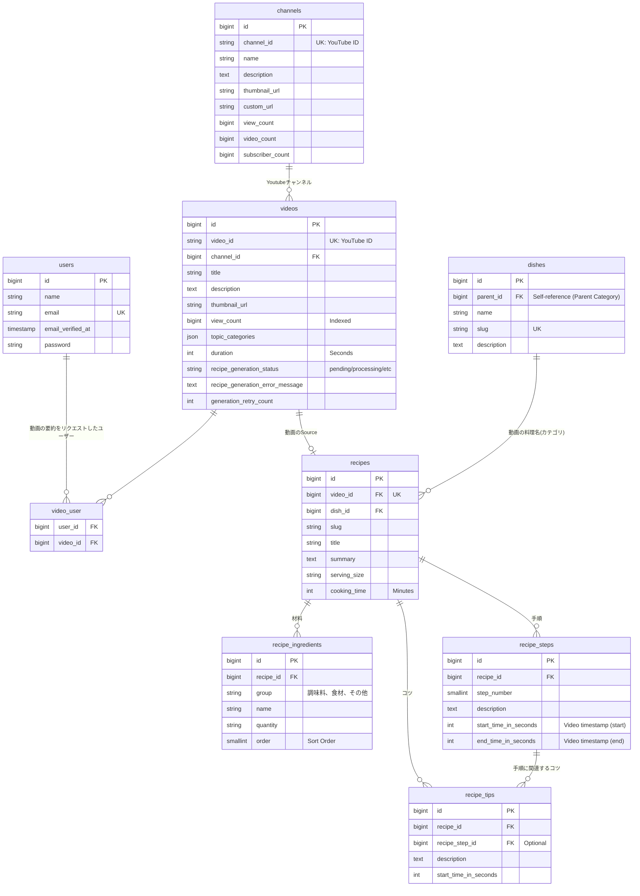

# 🍳 TubeChef (チューブシェフ)

**動画の「おいしそう」を、文字の「見やすさ」に。**

🌍 **アプリURL**: [https://app.cosmethod.com](https://app.cosmethod.com)

**フロントエンド**: [https://github.com/m0xyu/tubechef-frontend](https://github.com/m0xyu/tubechef-frontend)

動画を何度も止めたり、巻き戻したりする必要はありません。
TubeChefは、YouTubeの料理動画URLを入力するだけで、AIが動画から「材料」と「手順」を自動で書き起こすWebアプリケーションです。
動画を見る時間を最小限にショートカットし、あなたの料理体験をもっとスムーズにします。

---

## 🛠️ Tech Stack

| Category           | Technology                                              |
| :----------------- | :------------------------------------------------------ |
| **Frontend**       | React, TanStack Router, Tailwind CSS, Vite              |
| **Backend**        | Laravel 11, PHP 8.4, Laravel Sanctum (SPA Auth)         |
| **Infrastructure** | Docker, MySQL 8.0, Redis, Cloudflare (DNS / Pages), VPS |
| **Testing**        | PHPUnit, Pest                                           |
| **AI / API**       | YouTube Data API v3, Gemini API                         |

---

## 🏗️ Architecture & Design

「保守性・拡張性・テスト容易性」を重視したモダンなバックエンド設計を取り入れています。

- **Fat Controllerの排除 (Action & DTO)**
  複雑なビジネスロジックは単一責任の `Action` クラスに分離し、データのやり取りには配列ではなく型安全な **DTO (Data Transfer Object)** を採用しています。
- **LLM連携の抽象化 (Factory Pattern)**
  特定のAIモデルに依存しないよう、`LLMServiceInterface` と Factory パターンを用いて実装。将来的なモデル変更（OpenAI等）にも設定のみで対応可能な「オープン・クローズドの原則」に準拠しています。
- **堅牢なエラーハンドリング**
  PHP 8.1の Enum と独自例外クラスを組み合わせ、マジックナンバーを排除した厳密なステータス管理を行っています。

---

## 🔥 Technical Highlights

バックエンドのパフォーマンスと拡張性を意識し、以下の設計・実装を行っています。

### 非同期処理によるUX向上とスケーラビリティ

LLM（Gemini）によるレシピ生成処理は数秒〜十数秒の待機時間が発生するため、同期処理ではUXを著しく損なう懸念がありました。
これを解決するため、**Redis + Laravel Worker** を用いた非同期処理（Job）アーキテクチャを導入。即時にレスポンスを返しつつ、裏側で安全にタスクを処理するスケーラブルな構成を実現しています。

---

## 🗄️ データベース設計（ER図）

本プロジェクトでは、データの整合性とクエリパフォーマンスを両立させるため、適切な正規化とインデックス設計を行っています。YouTubeからのメタデータ（`videos`）と、AIによって生成された構造化データ（`recipes`）を分離し、拡張性の高い構造にしています。

### ER図



## 💻 Local Setup

Docker (Laravel Sail ベース) を使用して簡単に立ち上げ可能です。

```
git clone [https://github.com/yourusername/tubechef.git](https://github.com/yourusername/tubechef.git)
cd tubechef
cp .env.example .env

# Composer 依存関係のインストール (ローカルに PHP がない場合、Sail の一時コンテナを利用)
docker run --rm \
    -u "$(id -u):$(id -g)" \
    -v "$(pwd):/var/www/html" \
    -w /var/www/html \
    laravelsail/php84-composer:latest \
    composer install --ignore-platform-reqs

# コンテナのビルドと起動（バックグラウンド）
./vendor/bin/sail up -d

# アプリケーションキーの生成
./vendor/bin/sail artisan key:generate

# データベースのマイグレーション
./vendor/bin/sail artisan migrate
```
